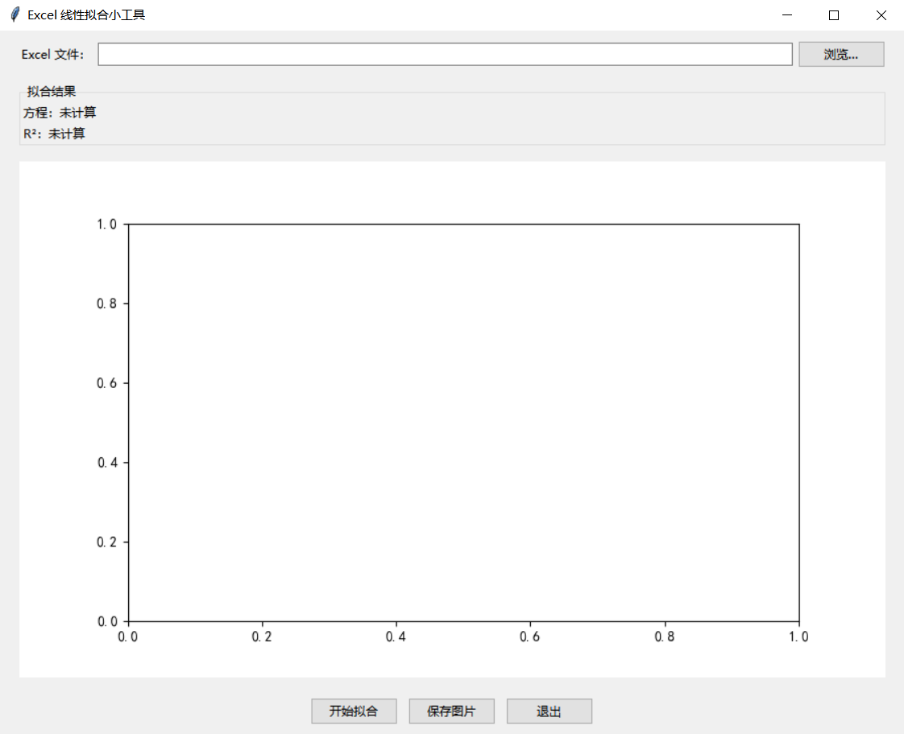

# Excel-Linear-Fit-GUI

一键线性拟合 Excel 数据的小工具，**双击即用**，无需安装 Python。

## 下载使用
1. 进入 [Releases](https://github.com/你的用户名/Excel-Linear-Fit-GUI/releases) 页面
2. 下载 `main.exe`
3. 双击运行 → 选择 Excel → 开始拟合 → 保存图片

## 本地打包
```bash
pip install -r requirements.txt
pyinstaller -F -w main.py
```

## 截图




